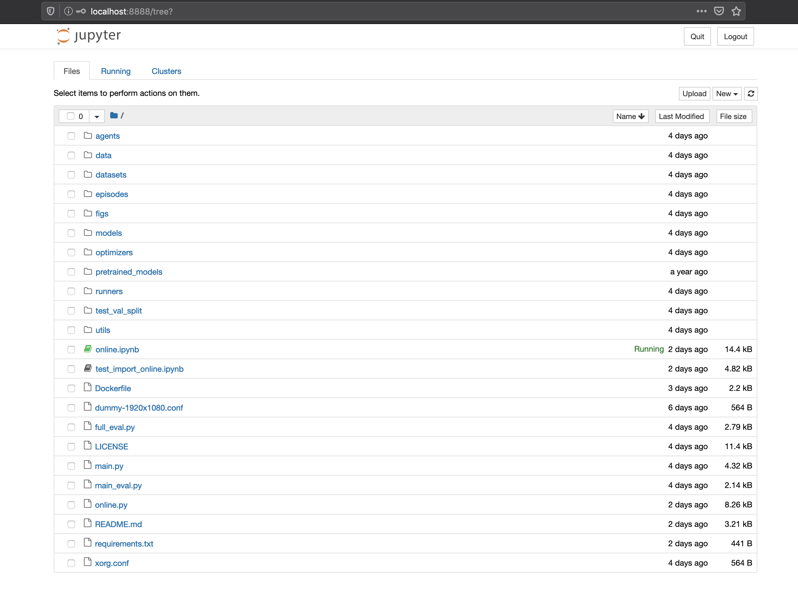
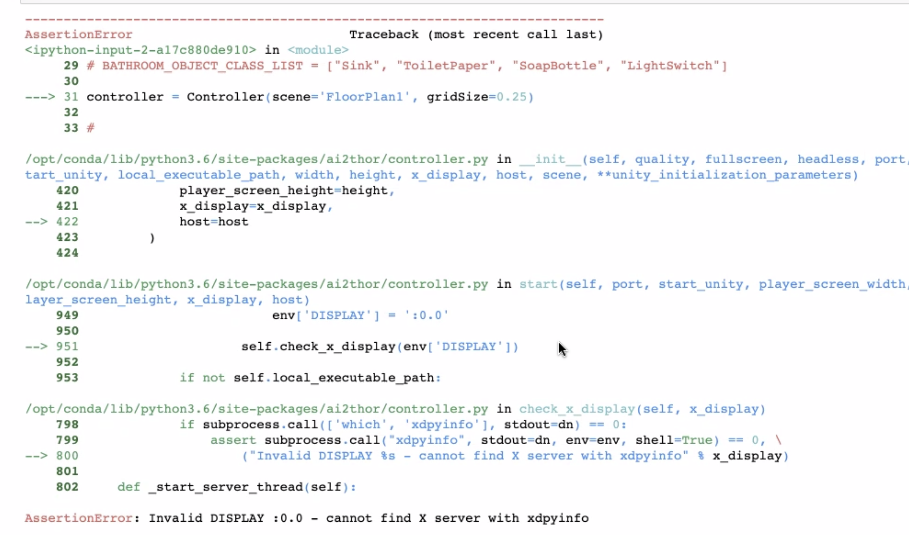
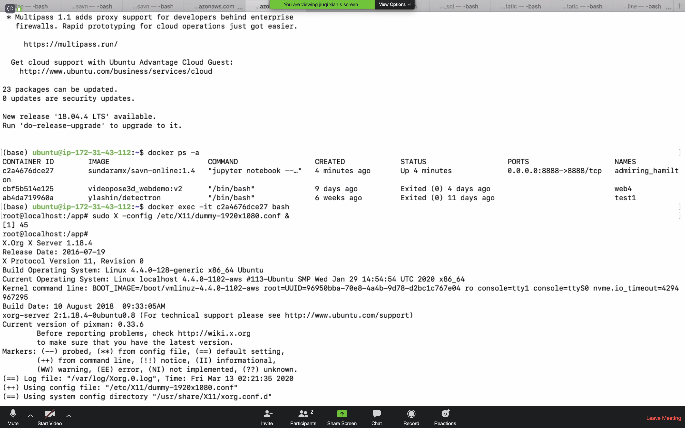

# Visual Navigation

Visual Navigation is a task where an agent uses a RGB camera to navigate. In our task, the agent's goal is to find a target object in an indoor scene. We based our work on [SAVN](https://github.com/allenai/savn), a target driven visual navigation model trained using meta-reinforcement learning. This model is trained using scenes in [Ai2thor](https://ai2thor.allenai.org/), a virtual-enviroment framework that provides photo-realistic scenes, physics engine, object interaction, etc.

## Problem Statement
In the SAVN project, the models are trained and tested in an offline Ai2thor environment, created by scraping images and ResNet features from a live environment for training efficiency. There is no script for inferencing that allows others to test the model in a live Ai2thor environmnent and get a qualitative evaluation. Thus, as part of our project, we aim to provide APIs for users to create a live agent in a live Ai2thor simulator, where this agent uses pretrained models for visual navigation tasks. 


## Input & Output Using Our API
Input: 
- Ai2thor Controller
- Target Name
- Model Name
- Necessary file paths (eg. Glove Embedding)

Output:
- Action ('LookUp', 'LookDown', 'RotateLeft', 'RotateRight', 'MoveAhead', or 'Done')

## Demo Video
[SAVN Agent looking for a laptop in Ai2Thor 2.2.0 Scene 210](https://youtu.be/HIuPZLSVVwY)

## Deliverables
- A jupyter notebook that provides a simple interface for evaluating models in live Ai2thor Simulator
- APIs that allow users to make the agent do one 'step' at a time, and receive 'observation' from enviroment
- Docker image
- Dockerfile

# Inference in Online Ai2Thor Environment.
## Set-up on local machine (Recommended. Tested with macOS Mojave 10.14.6)

- Clone the repository with `git clone https://github.com/xianjiuqi/savn_online.git && cd savn_online`.
- Create a conda environment. Assume miniconda3 is installed. Python 3 is required. 
```bash
conda create -n savn-online python=3.7
conda activate savn-online
```
- In `savn-onine` folder, run `pip install -r requirements.txt`
- In `savn-online` folder, to download pretrained models, run `wget https://prior-datasets.s3.us-east-2.amazonaws.com/savn/pretrained_models.tar.gz` Untar with `tar -xzf pretrained_models.tar.gz`


### Data for the Model
The `data` folder in `savn-online` contains:
- `thor_glove` which contains the [GloVe](https://nlp.stanford.edu/projects/glove/) embeddings for the navigation targets.
- `gcn` which contains the necessary data for the [Graph Convolutional Network (GCN)](https://arxiv.org/abs/1609.02907) in [Scene Priors](https://arxiv.org/abs/1810.06543), including the adjacency matrix.

The above `data` only allows for inferencing. If you want to train and evaluate the models, please refer to "Train and Evaluate" section below. 

### See a quick demo on jupyter notebook.
- After set-up, in command line, run `jupyter notebook`
- Open `online.ipynb` and run all the cells. On local machine, a display window will pop up, showing the scene viewed by agent.
- Please see the comment lines in the cell where Ai2thor controller is initiated, try target objects within corresponding scenes.

### Experiment with our Gym-like API calls
- Please refer to README_DOCUMENTATION
- Open `test_import_online.ipynb`

## Setup Docker on AWS
If you just want to see how the models perform in a live Ai2thor environment, using docker on AWS is not recommended, because there is not visual display for the scenes. However, it is still doable. 

- Choose the right image: Deep Learning AMI (Ubuntu 16.04) Version 26.0 (ami-025ed45832b817a35)


- This AMI comes with built support for nvidia drivers, docker environment.

- Launch the EC2 instance with P2.2xlarge instance type with GPU support.

- SSH into the launched EC2 instance by following instructions presented on Connect option in your AWS EC2 console.

- Pull the docker image with command : `docker pull sundaramx/savn-online:1.6`

- Start a container called 'savn' by  `docker run --rm  -it --name savn --privileged -p 8888:8888 --hostname localhost sundaramx/savn-online:1.6`

- In a new bash terminal ssh into your AWS EC2 instance using 
```
ssh -i "you-certificate-file.pem" -L 8000:localhost:8888 ubuntu@your-ec2-instance.compute-1.amazonaws.com
```
- Make sure 'savn' container is up and running `docker ps -a`
- bash into the 'savn' container by `docker exec -it savn bash`
- Fix potential display issue by `sudo X -config /etc/X11/dummy-1920x1080.conf &`. (Do this inside the container, hit enter twice). See "Known Issues on AWS Cloud" below.

you can launch the browser and type `localhost:8000`. If a token is required, copy and paste the token displayed when you first run the container.

- Open `online.ipynb` and `test-import-online.ipynb`




### Known Issues on AWS Cloud :
For some instances/ami type if the display server isn't automatically configured then you will see the below error while executing the cells within jupyter notebook



You can resolve this by following the below instructions.

Please login in to the docker container and execute the  following command and hit Enter

`sudo X -config /etc/X11/dummy-1920x1080.conf &`



Once the error is resolved you can continue to execute the cells normally


