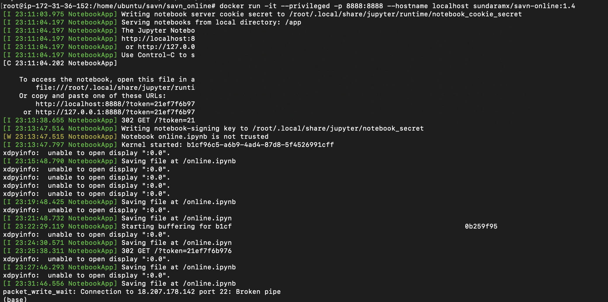
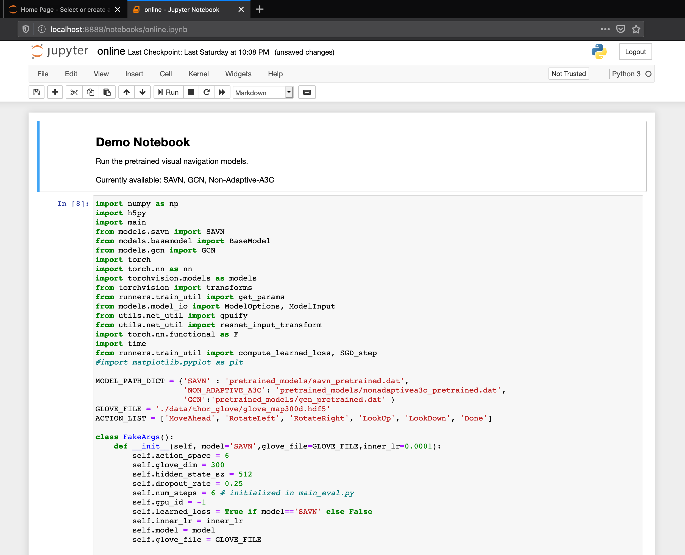

# Visual Navigation

Visual Navigation is a task where an agent uses a RGB camera to navigate. In our task, the agent's goal is to find a target object in an indoor scene. In recent years, there has been a lot of progress in visual navigation but it is not at the level where you can call it is state-of-art. Ai2thor is a virtual-enviroment framework that provides photo-realistic scenes, physics engine, object interaction and more. (In oreder to learn more about Ai2Thor Framework  and the original work on Self-Adaptive Visual Navigation please refer to https://ai2thor.allenai.org/ and https://github.com/allenai/savn respectively.

## Problem Statement
We based our work on [SAVN](https://github.com/allenai/savn), a target driven visual navigation model trained using meta-reinforcement learning. In SAVN is trained and tested in an offline Ai2thro environment, created by scraping images and ResNet features from a live environment for training efficiency. However, there is no script for inferencing that allows others to test the model in a live Ai2thor environmnent and get a qualitative evaluation. Thus, as part of our project, we aim to provide APIs so that users to create a live agent in a live Ai2thor simulator, where this agent uses pretrained models for visual navigation tasks. 

## Deliverables
- A jupyter notebook that provides a simple interface for evaluating models in live Ai2thor Simulator
- APIs that allow users to make the agent do one 'step' at a time, and receive 'observation' from enviroment
- Docker image
- Dockerfile
- Instructions for setting up training on cloud

# Inference in Online Ai2Thor Environment.
## Set-up on local machine (Tested with MacBook Pro)

- Clone the repository with `git clone https://github.com/xianjiuqi/savn_online.git && cd savn_online`.
- Create a conda environment. Assume miniconda3 is installed. Python 3 is required. 
```bash
conda create -n savn-online python=3.7
conda activate savn-online
```
- In `savn-onine` folder, run `pip install -r requirements.txt`
- In `savn-online` folder, to download pretrained models, run `wget https://prior-datasets.s3.us-east-2.amazonaws.com/savn/pretrained_models.tar.gz` Untar with `tar -xzf pretrained_models.tar.gz`


### Data for the Model
The `data` folder in `savn-online` contains:
- `thor_glove` which contains the [GloVe](https://nlp.stanford.edu/projects/glove/) embeddings for the navigation targets.
- `gcn` which contains the necessary data for the [Graph Convolutional Network (GCN)](https://arxiv.org/abs/1609.02907) in [Scene Priors](https://arxiv.org/abs/1810.06543), including the adjacency matrix.

The above `data` only allows for inferencing. If you want to train and evaluate the models, please refer to "Train and Evaluate" section below. 

### See a quick demo on jupyter notebook.
After set-up, in command line, run `jupyter notebook`
Open `savn-online/online.ipynb` and run all the cells. On local machine, a display window will pop up, showing the scene viewed by agent.

### If you want to experiment with our Gym-like API calls, please execute the cells within the below notebook:

`test_import_online.ipynb`

### Set Up Docker on AWS
If you just want to do inference, using docker on AWS is not recommended, because there is not visual display. However, it is still doable. The following set up applies for setting up training as well.
- Choose the right image: Deep Learning AMI (Ubuntu 16.04) Version 26.0 (ami-025ed45832b817a35)


- This AMI comes with built support for nvidia drivers, docker environment.

- Launch the EC2 instance with P2.2xlarge instance type with GPU support.

- SSH into the launched EC2 instance by following instructions presented on Connect option.

- Pull the docker image with command : docker pull sundaramx/savn-online:1.4

- Do `docker run --rm  -it --privileged -p 8888:8888 --hostname localhost sundaramx/savn-online:1.4`

- In a new bash terminal ssh into your AWS EC2 instance 
```
ssh -i "certificate file" -L 8000:localhost:8888 ubuntu@your-ec2-instance.compute-1.amazonaws.com
```
This way you can access the jupyter notebook on your local machine and run the cells present in the notebook to test 
the agent.


# Train and Evaluate
Setting up training environment with Ai2thor on cloud is not a trivial task. Some issues may occur, such as 'cannot find display' or 'cannot find sound card'. But in our Docker image these issues are fixed.
## Instructions for Training and Evaluating
### Set up
1. Your system has at least one GPU, and have `nvidia-docker` installed.
2. Assume you have cloned the `savn-online` repo. in `savn-online` directory, delete the `data` folder by `rm -r data`. Then download the full offline environment data `wget https://prior-datasets.s3.us-east-2.amazonaws.com/savn/data.tar.gz`. Be aware that this compressed file is around 13G, it decompressed into around 27G. Once download is finished, decompress with `tar -xzf data.tar.gz`. 
3. If you have not download the pretrained models, please see instructions in "Set-up on local machine" to download pretrained models.

4. Run `docker pull sundaramx/savn-online:1.4`

5. Start a container called `savn-train`, and mount your local `savn-online` directory to this container.
```
nvidia-docker run -v $PWD:/savn-online -d -it --privileged --name savn-train sundaramx/savn-online:1.4
```
6. Bash into the container just created 
```
docker exec -it savn-train bash
```

### Evaluate Pretrained SAVN
We adopted the following instructions from[SAVN](https://github.com/allenai/savn), the repo we base our work on. 
```
python main.py --eval \
    --test_or_val test \
    --episode_type TestValEpisode \
    --load_model pretrained_models/savn_pretrained.dat \
    --model SAVN \
    --gpu-ids 0 \
    --results_json savn_test.json 

cat savn_test.json
```
### Training SAVN
```
python main.py \
    --title savn_train \
    --model SAVN \
    --gpu-ids 0 \
    --workers 12 \
    --max_ep 6000000 \
    --ep_save_freq 100000 \
```
You may reduce maximum episode and save frequency by setting `--max_ep 200`, `--ep_save_freq 100`, just to verify your training environment is working.
### Evaluate your trained models
```
python full_eval.py \
    --title savn \
    --model SAVN \
    --results_json savn_results.json \
    --gpu-ids 0 
    
cat savn_results.json
```

## Setup on Docker 

We created the docker image and pushed our image to our docker hub.

You can pull the latest docker image with command : `docker pull sundaramx/savn-online:1.4`

Please refer the Dockerfile for details on dependencies for creating the docker image.

Once you have the docker image on your local or AWS Environment, you can run the docker container with following options

1)on AWS Env,  To access our online model execute

`docker run -it --privileged -p 8888:8888 --hostname localhost sundaramx/savn-online:1.4`



and once the container is running you will need to ssh into the AWS EC2 with below command to access the notebook on your local browser

`ssh -i "your certificate.pem" -L 8000:localhost:8888 ubuntu@ec2-54-164-eww5-179.compute-1.amazonaws.com`

After this command, you can launch the browser and access the jupyter notebook as shown below


You may proceed to launch our online model and execute cells to test the Agent for visual navigation as shown below.




