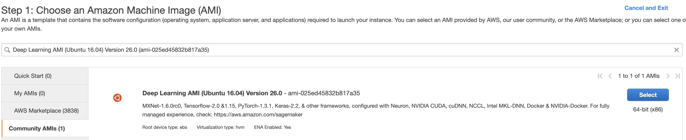

# Self Adaptive Visual Navigation

In recent years, there has been a lot of progress in visual navigation but it is not at the level where you can call it is  state-of-art. The one distinguishing framework that is attempting to provide a state-of-art navigation framework is the Ai2thor framework which also provides physics engine, object interaction and more. (In oreder to learn more about Ai2Thor Framework  and the original work on Self-Adaptive Visual Navigation please refer to https://ai2thor.allenai.org/ and https://github.com/allenai/savn respectively.

## Problem Statement
In the savn(https://github.com/allenai/savn) repo we based on, currenlty the agent is trained and tested in an offline Ai2thro environment, created by scraping images from a live environment and it is difficult to directly use the trained navigation models to a live Ai2thor environment. As part of our project, we aim to provide APIs so that users to create a live agent in a live Ai2thor simulator, where this agent uses pretrained models for visual navigation tasks. 

# Inference in Online Ai2Thor Environment.
### Set-up on local machine (Tested with MacBook Pro)

- Clone the repository with `git clone https://github.com/xianjiuqi/savn_online.git && cd savn_online`.
- Create a conda environment. Assume miniconda3 is installed. Python 3 is required. 
```bash
conda create -n savn-online python=3.7
conda activate savn-online
```
- In `savn-onine` folder, run `pip install -r requirements.txt`
- In `savn-online` folder, to download pretrained models, run `wget https://prior-datasets.s3.us-east-2.amazonaws.com/savn/pretrained_models.tar.gz` Untar with `tar -xzf pretrained_models.tar.gz`


### Data for the Model
The `data` folder in `savn-online` contains:
- `thor_glove` which contains the [GloVe](https://nlp.stanford.edu/projects/glove/) embeddings for the navigation targets.
- `gcn` which contains the necessary data for the [Graph Convolutional Network (GCN)](https://arxiv.org/abs/1609.02907) in [Scene Priors](https://arxiv.org/abs/1810.06543), including the adjacency matrix.

The above `data` only allows for inferencing. If you want to train and evaluate the models, please refer to "Train and Evaluate" section below. 

### See a quick demo on jupyter notebook.
After set-up, in command line, run `jupyter notebook`
Open `savn-online/online.ipynb` and run all the cells. On local machine, a display window will pop up, showing the scene viewed by agent.

### If you want to Experiment with our Gym-like API calls, please execute the cells within the below notebook:

`test_import_online.ipynb`

### Notice
If you want to run the demo on cloud in a Docker container, please follow instructions below. However, you may not able to get a visual display of the scene.


# Train and Evaluate
We adopted instructions from https://github.com/allenai/savn

## Setup on docker 

Please refer the Dockerfile for creating the creating he 


## Setup on AWS with docker 

Choose the right image:
Deep Learning AMI (Ubuntu 16.04) Version 26.0 (ami-025ed45832b817a35)




This AMI comes with built support for nvidia drivers, docker environment.

Launch the EC2 instance with P2.2xlarge instance type with GPU support.

SSH into the launched EC2 instance by following instructions presented on Connect option.

Pull the docker image with command : docker pull sundaramx/savn-online:1.4

docker run --rm  -it --privileged -p 8888:8888 --hostname localhost sundaramx/savn-online:1.1


on a new bash terminal ssh into your AWS EC2 instance 

ssh -i "certificate file" -L 8000:localhost:8888 ubuntu@your-ec2-instance.compute-1.amazonaws.com

This way you can access the jupoyter notebook on your local machine and run the cells present in the notebook to test 
the agent.


